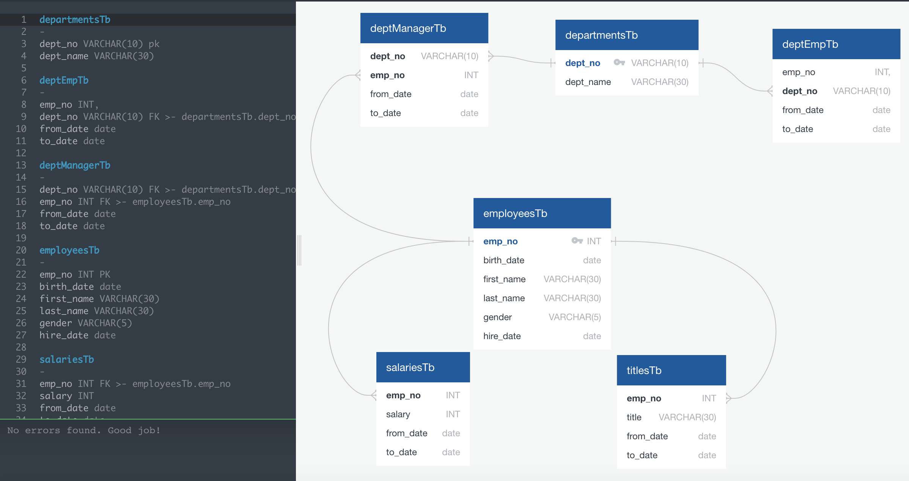

# Pewlett Hackard Company Analysis

An in depth analysis of employee salaries, titles, and departments at Pewlett Hackard.

Jupyter notebook used to join title and salary tables to analyze the average salary by title at Pewlett Hackard.

## Tables were generated to show:
1 - full list of employee number, last name, first name, gender, and salary.

2 - employees hired in 1986.

3 - the manager of each department with the date range of that position.

4 - all employeess and their department.

5 - all employees whose first name is "Hercules" and last names begin with "B" (surprising amount of Hercules at Pewlett Hackard)

6 - all employees in the Sales department.

7 - all employees in the Sales and Development departments.

8 - a count, in desceneding order, of all last names of employees at Pewlett Hackard.
